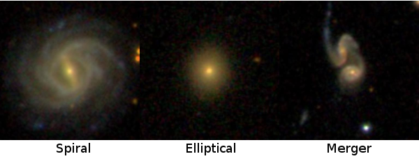

# Galaxy Classifier - Random Forest

## Overview

This project uses machine learning to classify galaxies into three types (ellipticals, spirals or galactic mergers) based on their observed properties. The solution is achieved with an implementation of the Random Forest algorithm.

The used data set is provided by the [Galaxy Zoo project](https://www.galaxyzoo.org/). The training images have been classifed and reviewed by voluteers.

The program outputs the model's accuracy score as well as a confusion matrix for further analysis.

## Dependencies
* [Numpy](http://www.numpy.org/)
* [Sklearn](http://scikit-learn.org/stable/)
* [Matplotlib](https://matplotlib.org/)

## Acknowledgments
* This application was developed as an exercise for Coursera's [Data-driven Astronomy](https://www.coursera.org/learn/data-driven-astronomy) course.
